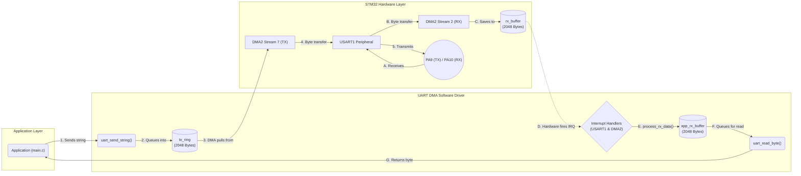
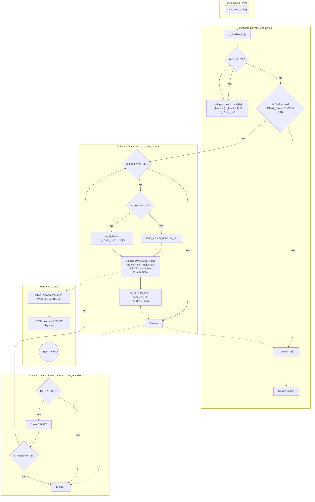
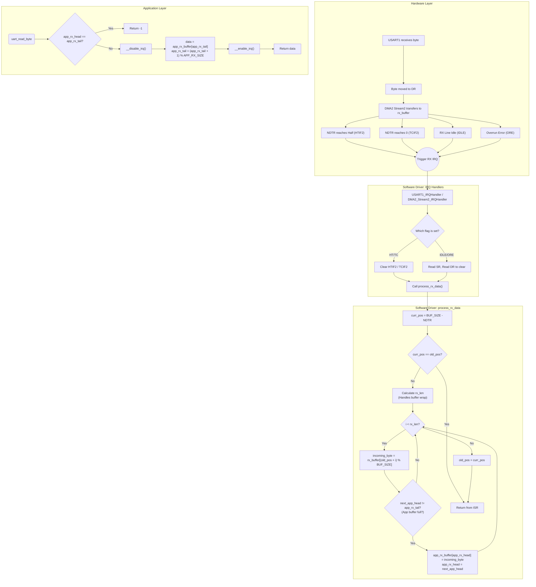

# Baremetal STM32 Playground Libraries

This repository contains custom bare-metal peripheral drivers for the STM32F411CE (Blackpill) microcontroller. The libraries focus on direct register manipulation using the CMSIS device header, avoiding heavy hardware abstraction layers like HAL.

Below is the documentation for the provided libraries located in the `lib/` directory.

## 1. Timer (`lib/Timer`)
A simple timer driver that configures `TIM2` to blink an LED.

### Features
- Configures `TIM2` as a basic timebase generator.
- Uses interrupts (`TIM2_IRQn`) to handle periodic events.
- Hardcoded to toggle the onboard LED connected to `PC13`.
- Operates entirely asynchronously in the background once initialized.

### Function Blocks & API

#### Public API
- **`void timer2_led_init(void)`**
  - **Purpose:** Initializes the basic timebase and the GPIO output for the LED.
  - **Hardware Interaction:** 
    - Enables APB1 clock for `TIM2` and AHB1 clock for `GPIOC`.
    - Configures `PC13` as a General Purpose Output.
    - Sets `TIM2->PSC` (Prescaler) to `16000` and `TIM2->ARR` (Auto-reload) to `500` to dictate the interrupt frequency.
    - Enables the `TIM2_IRQn` update interrupt in the NVIC and starts the counter (`TIM_CR1_CEN`).

#### Interrupt Handlers
- **`void TIM2_IRQHandler(void)`**
  - **Purpose:** Handles the periodic timer overflow.
  - **Logic:** Checks the Update Interrupt Flag (`UIF`), clears it to acknowledge the interrupt, and toggles the `PC13` output data register (`ODR`) to blink the LED.

## 2. UART DMA Driver (`lib/UART_DMA_Driver`)
A robust, non-blocking UART driver using DMA (Direct Memory Access) for both transmission (TX) and reception (RX) on `USART1`.

### Features
- **Zero-blocking transmission**: Uses a software ring buffer (2048 bytes) and hardware DMA (`DMA2_Stream7`) to push data chunks asynchronously without halting the CPU.
- **Efficient Reception**: Utilizes a circular hardware DMA buffer (2048 bytes) combined with a software application ring buffer (2048 bytes).
- **Variable-length RX Handling**: Implements the `USART_IDLE` line interrupt along with DMA Half-Transfer (HT) and Transfer-Complete (TC) interrupts. This guarantees that received data is parsed instantly, even if it doesn't fill the entire DMA buffer.
- **Hardware Map**: Uses `USART1` mapped to `PA9` (TX) and `PA10` (RX) with a baud rate of 115200.

### Function Blocks & API

#### Public API
- **`void uart_dma_system_init(void)`**
  - **Purpose:** Fully configures the USART hardware, GPIO pins, and DMA streams for bidirectional asynchronous communication.
  - **Hardware Interaction:**
    - Enables `GPIOA`, `DMA2`, and `USART1` clocks.
    - Configures `PA9` (TX) and `PA10` (RX) to Alternate Function 7 (USART1).
    - Sets USART1 baud rate to 115200 and enables IDLE line detection interrupt.
    - Configures `DMA2_Stream7` (TX) for Memory-to-Peripheral transfers.
    - Configures `DMA2_Stream2` (RX) in Circular mode for Peripheral-to-Memory transfers.
    - Enables all relevant NVIC interrupts with RX prioritized over TX.
    
- **`void uart_send_string(const char *str)`**
  - **Purpose:** Non-blocking function to send a string.
  - **Logic:** Temporarily disables interrupts to protect the buffer state, copies characters into the software `tx_ring`, and calls `start_tx_dma_chunk()` if a DMA transfer is not already actively running.

- **`int16_t uart_read_byte(void)`**
  - **Purpose:** Reads the next available received byte from the software buffer.
  - **Logic:** Returns `-1` if `app_rx_head == app_rx_tail` (empty). Otherwise, safely pops one byte from `app_rx_buffer` and returns it as a 16-bit integer.

#### Internal/Static Functions
- **`static void start_tx_dma_chunk(void)`**
  - **Purpose:** Calculates the next linear chunk of data in the `tx_ring` and kicks off `DMA2_Stream7`.
  - **Logic:** Handles ring buffer wrap-around by sending data up to the end of the array first, then wrapping on the next call. Sets `M0AR` (memory address) and `NDTR` (number of bytes), and enables the DMA stream.
  
- **`static void process_rx_data(void)`**
  - **Purpose:** Moves freshly received bytes from the hardware circular `rx_buffer` into the software `app_rx_buffer`.
  - **Logic:** Uses the DMA's remaining transfer count (`NDTR`) to calculate how many new bytes arrived since the last check (`old_pos`). Iterates through the hardware buffer and copies them over.

#### Interrupt Handlers
- **`void USART1_IRQHandler(void)`**
  - Fires when the RX line goes idle. Acknowledges the flag by reading `SR` and `DR`, then calls `process_rx_data()`.
- **`void DMA2_Stream2_IRQHandler(void)`**
  - Fires on RX DMA Half-Transfer (HT) or Transfer-Complete (TC). Clears the respective flags and calls `process_rx_data()`.
- **`void DMA2_Stream7_IRQHandler(void)`**
  - Fires when a TX DMA chunk completes. Clears the flag and if more data remains in `tx_ring`, calls `start_tx_dma_chunk()` again to keep transmitting.

### Architecture Diagrams

#### High-Level System Block Diagram
This diagram illustrates the macro-level data flow between the application, the software ring buffers, the DMA hardware, and the USART peripheral.

#### Detailed TX Flow - Transmission

#### RX Flow - Reception

