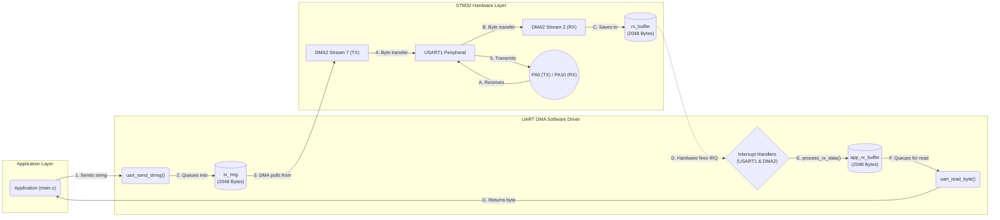
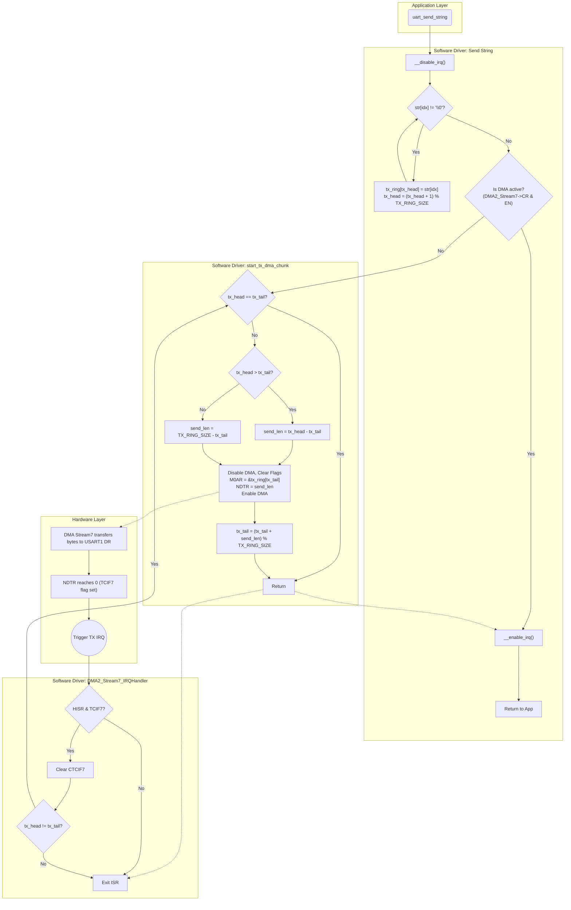
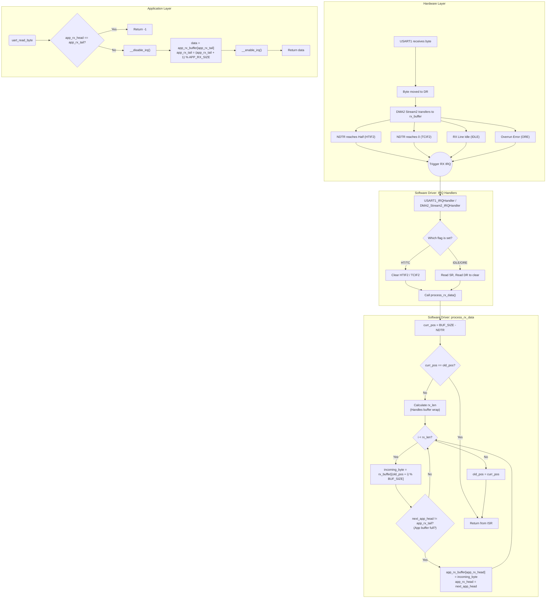

# Baremetal STM32 Playground Libraries

This repository contains custom bare-metal peripheral drivers for the STM32F411CE (Blackpill) microcontroller. The libraries focus on direct register manipulation using the CMSIS device header, avoiding heavy hardware abstraction layers like HAL.

Below is the documentation for the provided libraries located in the `lib/` directory.

## 1. RCC (`lib/RCC`)
A clock configuration driver that transitions the STM32F411 from its default 16 MHz internal oscillator (HSI) to a high-speed **96 MHz** clock using the 25 MHz external crystal (HSE).

### PLL Clock Equations
The system clock (SYSCLK) and USB clock (USBCLK) are derived from the external HSE crystal using the following Phase-Locked Loop (PLL) equations:

### PLL Clock Equations & Design Guidelines
The system clock (SYSCLK) is derived from the external HSE crystal using the following register-level formula:

$$\text{SYSCLK} = \frac{\text{HSE}}{\text{PLLM}} \times \frac{\text{PLLN}}{\text{PLLP}}$$

To configure the PLL for any target system clock ($f_{\text{SYSCLK}}$) and USB clock ($f_{\text{USB}}$), use the following design equations and constraints:

1. **Set $M$ (VCO Input Divider):**
   Divide $f_{\text{HSE}}$ to achieve a $1\text{ MHz}$ input clock to the PLL VCO (allowed range: $1\text{ MHz} \le f_{\text{VCO\_IN}} \le 2\text{ MHz}$):
   $$M = \frac{f_{\text{HSE}}}{1\text{ MHz}} \quad \implies \quad f_{\text{VCO\_IN}} = 1\text{ MHz}$$
   *(For the 25 MHz crystal, setting $M = 25$ gives exactly $1\text{ MHz}$.)*

2. **Determine $N$ and $P$ (SYSCLK Multiplication & Division):**
   Select a division factor $P \in \{2, 4, 6, 8\}$ and calculate the multiplier $N$ such that:
   $$N = P \times \frac{f_{\text{SYSCLK\_target}}}{1\text{ MHz}}$$
   *Constraint:* The multiplier $N$ must be an integer, and the resulting VCO output frequency $f_{\text{VCO\_OUT}}$ must satisfy:
   $$100\text{ MHz} \le (1\text{ MHz} \times N) \le 432\text{ MHz} \quad \implies \quad 100 \le N \le 432$$

3. **Determine $Q$ (USB Prescaler, optional):**
   For USB operation, the USB peripheral requires a precise $48\text{ MHz}$ clock. Thus, $N$ must be a multiple of 48:
   $$Q = \frac{N}{48} \quad \implies \quad Q \in \{2, 3, \dots, 15\} \text{ (must be an integer)}$$

---

### Step-by-Step Calculation for a 96 MHz Target SYSCLK:
Using the BlackPill's **25 MHz HSE** crystal ($f_{\text{HSE}} = 25\text{ MHz}$):
1. **Calculate $M$:**
   $$M = \frac{25\text{ MHz}}{1\text{ MHz}} = 25$$
2. **Select $P$ and Calculate $N$:**
   If we choose $P = 2$:
   $$N = 2 \times \frac{96\text{ MHz}}{1\text{ MHz}} = 192$$
   *Check constraints:* $192$ is within the $100 \le N \le 432$ range. (Valid!)
3. **Calculate $Q$ for USB (48 MHz):**
   $$Q = \frac{192}{48} = 4 \quad \text{(Valid integer!)}$$

---

### Features
- Configures the main PLL parameters: $M = 25$, $N = 192$, $P = 2$, $Q = 4$ to achieve a 96 MHz system clock and a 48 MHz USB clock.
- Sets Flash latency to 3 wait states (`FLASH_ACR_LATENCY_3WS`) to support 96 MHz execution.
- Enables speed-up caches: Instruction Cache, Data Cache, and Prefetch Buffer.
- Configures bus prescalers: AHB = 1 (96 MHz), APB1 = 2 (48 MHz), and APB2 = 1 (96 MHz).

### Function Blocks & API
- **`void rcc_system_init(void)`**
  - **Purpose:** Configures the clock system to run at 96 MHz using the external HSE oscillator.
  - **Hardware Interaction:**
    - Enables HSE and waits for stability (`HSERDY`).
    - Configures PWR regulator to Voltage Scale 1 to allow running at high frequencies.
    - Sets flash wait states and enables the caches.
    - Safely clears and updates `RCC->CFGR` for bus dividers.
    - Configures, enables, and switches to the main PLL.

---

## 2. Timer (`lib/Timer`)
A simple timer driver that configures `TIM2` to blink an LED.

### Features
- Configures `TIM2` as a basic timebase generator.
- Uses interrupts (`TIM2_IRQn`) to handle periodic events.
- Hardcoded to toggle the onboard LED connected to `PC13`.
- Operates entirely asynchronously in the background once initialized.

### Timer Math & Frequency Equation
Under the 96 MHz system clock configuration:
1. **Timer Input Clock:** `TIM2` is connected to the APB1 bus. Since the APB1 prescaler is set to 2 (`PPRE1 = DIV2`), the timer clock frequency is multiplied by 2:
   $$f_{\text{TIM2\_CLK}} = 2 \times f_{\text{APB1}} = 2 \times 48\text{ MHz} = 96\text{ MHz}$$
2. **Frequency Equation:**
   $$\text{Update Frequency} = \frac{f_{\text{TIM2\_CLK}}}{(\text{Prescaler} + 1) \times (\text{Auto-Reload} + 1)}$$
3. **Calculating for a 500 ms period (2 Hz overflow frequency):**
   Setting $\text{Prescaler} = 16000 - 1 = 15999$:
   $$2\text{ Hz} = \frac{96,000,000}{16000 \times (\text{ARR} + 1)}$$
   $$\text{ARR} + 1 = \frac{96,000,000}{16000 \times 2} = 3000 \implies \text{ARR} = 3000 - 1 = 2999$$

### Function Blocks & API

#### Public API
- **`void timer2_led_init(void)`**
  - **Purpose:** Initializes the basic timebase and the GPIO output for the LED.
  - **Hardware Interaction:** 
    - Enables APB1 clock for `TIM2` and AHB1 clock for `GPIOC`.
    - Configures `PC13` as a General Purpose Output.
    - Sets `TIM2->PSC` (Prescaler) to `15999` and `TIM2->ARR` (Auto-reload) to `2999` to yield the 2 Hz toggle rate.
    - Enables the `TIM2_IRQn` update interrupt in the NVIC and starts the counter (`TIM_CR1_CEN`).

#### Interrupt Handlers
- **`void TIM2_IRQHandler(void)`**
  - **Purpose:** Handles the periodic timer overflow.
  - **Logic:** Checks the Update Interrupt Flag (`UIF`), clears it to acknowledge the interrupt, and toggles the `PC13` output data register (`ODR`) to blink the LED.

---

## 3. UART DMA Driver (`lib/UART_DMA_Driver`)
A robust, non-blocking UART driver using DMA (Direct Memory Access) for both transmission (TX) and reception (RX) on `USART1`.

### Features
- **Zero-blocking transmission**: Uses a software ring buffer (2048 bytes) and hardware DMA (`DMA2_Stream7`) to push data chunks asynchronously without halting the CPU.
- **Efficient Reception**: Utilizes a circular hardware DMA buffer (2048 bytes) combined with a software application ring buffer (2048 bytes).
- **Variable-length RX Handling**: Implements the `USART_IDLE` line interrupt along with DMA Half-Transfer (HT) and Transfer-Complete (TC) interrupts. This guarantees that received data is parsed instantly, even if it doesn't fill the entire DMA buffer.
- **Hardware Map**: Uses `USART1` mapped to `PA9` (TX) and `PA10` (RX) with a baud rate of 115200.

### Baud Rate Configuration & Equation
USART1 is on the APB2 bus. Under the 96 MHz system clock configuration with the APB2 prescaler set to 1, the bus runs at 96 MHz ($f_{\text{CK}} = 96,000,000\text{ Hz}$).

The general formula to calculate the division factor $\text{USARTDIV}$ is:

$$\text{USARTDIV} = \frac{f_{\text{CK}}}{8 \times (2 - \text{OVER8}) \times \text{Baud Rate}}$$

Where:
- $\text{OVER8}$ is the oversampling mode in the `USART_CR1` register (either `0` for oversampling by 16, or `1` for oversampling by 8).

Since this driver uses oversampling by 16 ($\text{OVER8} = 0$), the formula simplifies to:
$$\text{USARTDIV} = \frac{f_{\text{CK}}}{16 \times \text{Baud Rate}}$$

To encode this into the `BRR` register, the value must be multiplied by 16 (which effectively shifts the integer part left by 4 bits to make room for the 4 fractional bits):

$$\text{BRR\_value} = \text{USARTDIV} \times 16 = \frac{f_{\text{CK}}}{\text{Baud Rate}}$$

To ensure correct rounding to the nearest integer in C, we add half of the divisor ($\text{Baud Rate} / 2$) to the numerator before performing integer division:

$$\text{BRR\_value} = \frac{f_{\text{CK}} + (\text{Baud Rate} / 2)}{\text{Baud Rate}}$$

For a target baud rate of **115200**:
$$\text{BRR\_value} = \frac{96,000,000 + 57600}{115200} \approx 833.8 \rightarrow 833 = \text{0x0341}$$

### Function Blocks & API

#### Public API
- **`void uart_dma_system_init(void)`**
  - **Purpose:** Fully configures the USART hardware, GPIO pins, and DMA streams for bidirectional asynchronous communication.
  - **Hardware Interaction:**
    - Enables `GPIOA`, `DMA2`, and `USART1` clocks.
    - Configures `PA9` (TX) and `PA10` (RX) to Alternate Function 7 (USART1).
    - Sets USART1 baud rate to 115200 by setting `USART1->BRR = 0x0341`.
    - Enables the IDLE line detection interrupt.
    - Configures `DMA2_Stream7` (TX) for Memory-to-Peripheral transfers.
    - Configures `DMA2_Stream2` (RX) in Circular mode for Peripheral-to-Memory transfers.
    - Enables all relevant NVIC interrupts with RX prioritized over TX.

- **`void uart_send_string(const char *str)`**
  - **Purpose:** Non-blocking function to send a string.
  - **Logic:** Temporarily disables interrupts to protect the buffer state, copies characters into the software `tx_ring`, and calls `start_tx_dma_chunk()` if a DMA transfer is not already actively running.

- **`int16_t uart_read_byte(void)`**
  - **Purpose:** Reads the next available received byte from the software buffer.
  - **Logic:** Returns `-1` if `app_rx_head == app_rx_tail` (empty). Otherwise, safely pops one byte from `app_rx_buffer` and returns it as a 16-bit integer.

#### Internal/Static Functions
- **`static void start_tx_dma_chunk(void)`**
  - **Purpose:** Calculates the next linear chunk of data in the `tx_ring` and kicks off `DMA2_Stream7`.
  - **Logic:** Handles ring buffer wrap-around by sending data up to the end of the array first, then wrapping on the next call. Sets `M0AR` (memory address) and `NDTR` (number of bytes), and enables the DMA stream.
  
- **`static void process_rx_data(void)`**
  - **Purpose:** Moves freshly received bytes from the hardware circular `rx_buffer` into the software `app_rx_buffer`.
  - **Logic:** Uses the DMA's remaining transfer count (`NDTR`) to calculate how many new bytes arrived since the last check (`old_pos`). Iterates through the hardware buffer and copies them over.

#### Interrupt Handlers
- **`void USART1_IRQHandler(void)`**
  - Fires when the RX line goes idle. Acknowledges the flag by reading `SR` and `DR`, then calls `process_rx_data()`.
- **`void DMA2_Stream2_IRQHandler(void)`**
  - Fires on RX DMA Half-Transfer (HT) or Transfer-Complete (TC). Clears the respective flags and calls `process_rx_data()`.
- **`void DMA2_Stream7_IRQHandler(void)`**
  - Fires when a TX DMA chunk completes. Clears the flag and if more data remains in `tx_ring`, calls `start_tx_dma_chunk()` again to keep transmitting.

### Architecture Diagrams

#### High-Level System Block Diagram
This diagram illustrates the macro-level data flow between the application, the software ring buffers, the DMA hardware, and the USART peripheral.

```mermaid
flowchart LR
    subgraph AppLayer [Application Layer]
        App("Application (main.c)")
    end

    subgraph DriverLayer [UART DMA Software Driver]
        SendAPI("uart_send_string()")
        ReadAPI("uart_read_byte()")
        
        TX_Ring[("tx_ring<br/>(2048 Bytes)")]
        RX_App[("app_rx_buffer<br/>(2048 Bytes)")]
        
        ISR{"Interrupt Handlers<br/>(USART1 & DMA2)"}
    end

    subgraph HardwareLayer [STM32 Hardware Layer]
        DMA_TX["DMA2 Stream 7 (TX)"]
        DMA_RX["DMA2 Stream 2 (RX)"]
        
        RX_HW[("rx_buffer<br/>(2048 Bytes)")]
        
        USART["USART1 Peripheral"]
        Pins(("PA9 (TX) / PA10 (RX)"))
    end

    %% TX Path
    App -- "1. Sends string" --> SendAPI
    SendAPI -- "2. Queues into" --> TX_Ring
    TX_Ring -- "3. DMA pulls from" --> DMA_TX
    DMA_TX -- "4. Byte transfer" --> USART
    USART -- "5. Transmits" --> Pins

    %% RX Path
    Pins -- "A. Receives" --> USART
    USART -- "B. Byte transfer" --> DMA_RX
    DMA_RX -- "C. Saves to" --> RX_HW
    RX_HW -. "D. Hardware fires IRQ" .-> ISR
    ISR -- "E. process_rx_data()" --> RX_App
    RX_App -- "F. Queues for read" --> ReadAPI
    ReadAPI -- "G. Returns byte" --> App
```

#### Detailed TX Flow - Transmission

```mermaid
flowchart TD
    subgraph App [Application Layer]
        AppTx(uart_send_string)
    end

    subgraph Driver_Send [Software Driver: Send String]
        DisableIRQ["__disable_irq()"]
        CopyLoop{"str[idx] != '\\0'?"}
        CopyTx["tx_ring[tx_head] = str[idx]<br/>tx_head = (tx_head + 1) % TX_RING_SIZE"]
        CheckDMA{"Is DMA active?<br/>(DMA2_Stream7->CR & EN)"}
        EnableIRQ["__enable_irq()"]
        TxWait["Return to App"]
    end

    subgraph Driver_DMA [Software Driver: start_tx_dma_chunk]
        CheckEmpty{"tx_head == tx_tail?"}
        CalcLen{"tx_head > tx_tail?"}
        LenLinear["send_len = tx_head - tx_tail"]
        LenWrap["send_len = TX_RING_SIZE - tx_tail"]
        CfgDMA["Disable DMA, Clear Flags<br/>M0AR = &tx_ring[tx_tail]<br/>NDTR = send_len<br/>Enable DMA"]
        UpdateTail["tx_tail = (tx_tail + send_len) % TX_RING_SIZE"]
        ReturnSub["Return"]
    end

    subgraph Hardware [Hardware Layer]
        DMATx["DMA Stream7 transfers bytes to USART1 DR"]
        HwTC["NDTR reaches 0 (TCIF7 flag set)"]
        TriggerIRQ(("Trigger TX IRQ"))
    end

    subgraph Driver_ISR [Software Driver: DMA2_Stream7_IRQHandler]
        CheckTCIF{"HISR & TCIF7?"}
        ClearFlag["Clear CTCIF7"]
        CheckTxQ{"tx_head != tx_tail?"}
        ISRExit["Exit ISR"]
    end

    AppTx --> DisableIRQ
    DisableIRQ --> CopyLoop
    CopyLoop -- Yes --> CopyTx
    CopyTx --> CopyLoop
    CopyLoop -- No --> CheckDMA
    
    CheckDMA -- No --> CheckEmpty
    CheckDMA -- Yes --> EnableIRQ
    
    CheckEmpty -- No --> CalcLen
    CheckEmpty -- Yes --> ReturnSub
    CalcLen -- Yes --> LenLinear
    CalcLen -- No --> LenWrap
    LenLinear --> CfgDMA
    LenWrap --> CfgDMA
    CfgDMA --> UpdateTail
    UpdateTail --> ReturnSub
    
    ReturnSub -.-> EnableIRQ
    ReturnSub -.-> ISRExit
    
    EnableIRQ --> TxWait
    
    CfgDMA -.-> DMATx
    DMATx --> HwTC
    HwTC --> TriggerIRQ
    TriggerIRQ --> CheckTCIF
    
    CheckTCIF -- Yes --> ClearFlag
    CheckTCIF -- No --> ISRExit
    ClearFlag --> CheckTxQ
    CheckTxQ -- Yes --> CheckEmpty
    CheckTxQ -- No --> ISRExit
```

#### RX Flow - Reception

```mermaid
flowchart TD
    subgraph Hardware [Hardware Layer]
        HwRx[USART1 receives byte]
        HwDR[Byte moved to DR]
        DMARx[DMA2 Stream2 transfers to rx_buffer]
        HwHT["NDTR reaches Half (HTIF2)"]
        HwTC["NDTR reaches 0 (TCIF2)"]
        HwIDLE["RX Line Idle (IDLE)"]
        HwORE["Overrun Error (ORE)"]
        TriggerIRQ_RX(("Trigger RX IRQ"))
    end

    subgraph Driver_ISR [Software Driver: IRQ Handlers]
        ISREntry["USART1_IRQHandler /<br/>DMA2_Stream2_IRQHandler"]
        CheckFlags{"Which flag is set?"}
        ClearHT_TC["Clear HTIF2 / TCIF2"]
        ClearIDLE_ORE["Read SR, Read DR to clear"]
        CallProc["Call process_rx_data()"]
    end
    
    subgraph Driver_Proc [Software Driver: process_rx_data]
        CalcPos["curr_pos = BUF_SIZE - NDTR"]
        CheckPos{"curr_pos == old_pos?"}
        CalcLen["Calculate rx_len<br/>(Handles buffer wrap)"]
        LoopStart{"i < rx_len?"}
        GetByte["incoming_byte = rx_buffer[(old_pos + i) % BUF_SIZE]"]
        CheckFull{"next_app_head != app_rx_tail?<br/>(App buffer full?)"}
        SaveByte["app_rx_buffer[app_rx_head] = incoming_byte<br/>app_rx_head = next_app_head"]
        UpdateOldPos["old_pos = curr_pos"]
        ProcRet["Return from ISR"]
    end

    subgraph App [Application Layer]
        AppRx(uart_read_byte)
        CheckEmptyRx{"app_rx_head == app_rx_tail?"}
        RetEmpty["Return -1"]
        ReadDisIRQ["__disable_irq()"]
        ReadData["data = app_rx_buffer[app_rx_tail]<br/>app_rx_tail = (app_rx_tail + 1) % APP_RX_SIZE"]
        ReadEnIRQ["__enable_irq()"]
        RetData["Return data"]
    end

    HwRx --> HwDR
    HwDR --> DMARx
    DMARx --> HwHT
    DMARx --> HwTC
    DMARx --> HwIDLE
    DMARx --> HwORE
    
    HwHT --> TriggerIRQ_RX
    HwTC --> TriggerIRQ_RX
    HwIDLE --> TriggerIRQ_RX
    HwORE --> TriggerIRQ_RX
    
    TriggerIRQ_RX --> ISREntry
    ISREntry --> CheckFlags
    CheckFlags -- HT/TC --> ClearHT_TC
    CheckFlags -- IDLE/ORE --> ClearIDLE_ORE
    ClearHT_TC --> CallProc
    ClearIDLE_ORE --> CallProc
    
    CallProc --> CalcPos
    CalcPos --> CheckPos
    CheckPos -- Yes --> ProcRet
    CheckPos -- No --> CalcLen
    CalcLen --> LoopStart
    LoopStart -- Yes --> GetByte
    GetByte --> CheckFull
    CheckFull -- Yes --> SaveByte
    CheckFull -- No --> LoopStart
    SaveByte --> LoopStart
    LoopStart -- No --> UpdateOldPos
    UpdateOldPos --> ProcRet
    
    AppRx --> CheckEmptyRx
    CheckEmptyRx -- Yes --> RetEmpty
    CheckEmptyRx -- No --> ReadDisIRQ
    ReadDisIRQ --> ReadData
    ReadData --> ReadEnIRQ
    ReadEnIRQ --> RetData
```
